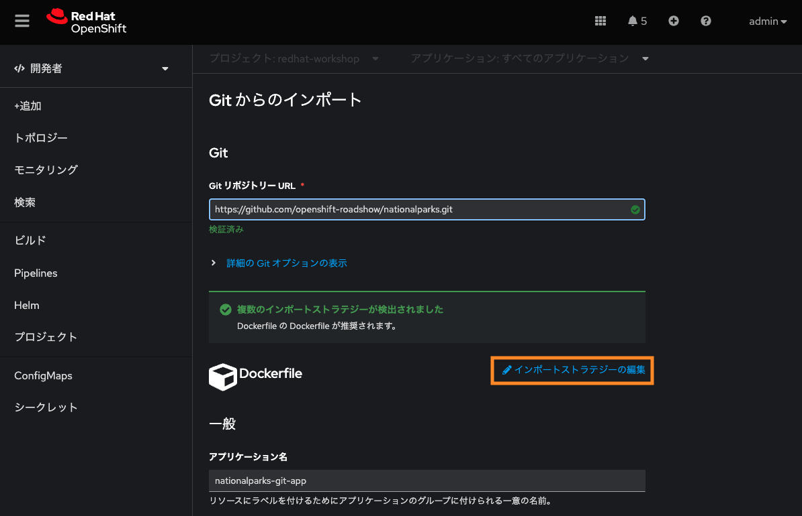
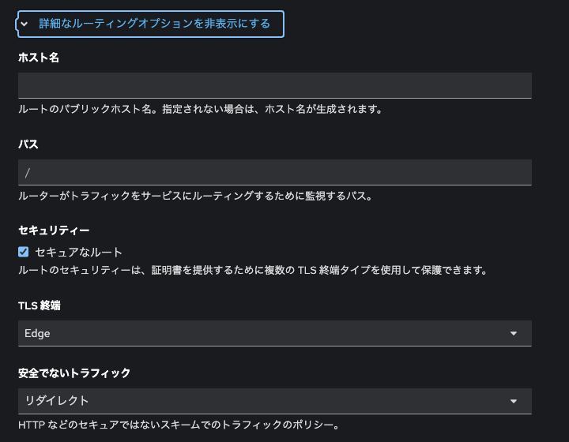
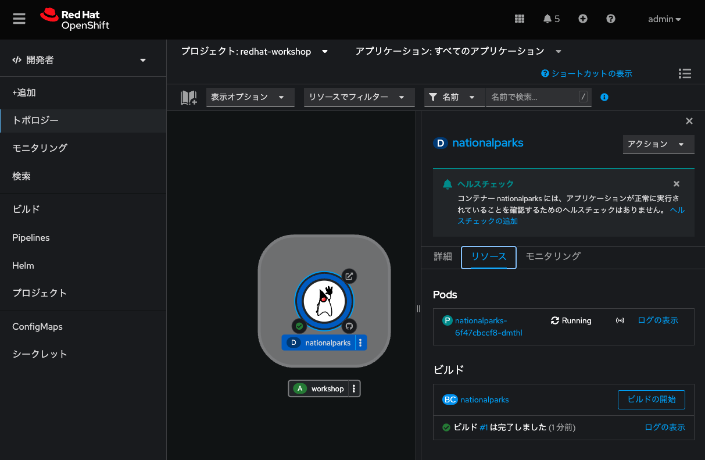
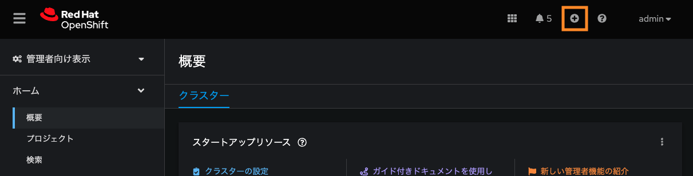

# アプリケーションデプロイメント基礎(s2i,Tekton)

## シナリオ

このラボでは、パイプラインと、アプリケーションのライフサイクルを処理するようにOpenShiftでパイプラインを設定する方法について学習します。

* OpenShift Pipelinesは、 Tektonを使用してパイプラインを構築するためのクラウドネイティブの継続的インテグレーションおよびデリバリー（CI / CD）ソリューションです。
* Tektonは、柔軟なKubernetesネイティブのオープンソースCI / CDフレームワークであり、基盤となる詳細を抽象化することで、複数のプラットフォーム（Kubernetes、サーバーレス、VMなど）へのデプロイを自動化できます。

### ゴール
* s2iで、Javaアプリケーションをデプロイします。
* Pipeline リソースで利用する永続ボリュームを作成します。
* OpenShift Pipelinesで、Pipeline を作成します。
* 作成したPipelineを実行して、擬似的に新しいイメージとしてアプリケーションを再デプロイします。

## Javaアプリケーションの作成
このラボには独自のgitリポジトリがあるので、単純なJava S2Iイメージで使用してみましょう。

* **プロジェクトの作成**
  
  *Name* を `workshop` として、プロジェクトを作成します。

* **アプリケーションのビルド**

  * Developer パースペクティブで、左側のナビゲーションで[+Add]をクリックし、[Git Repository]セクションより `Import from Git` を選択します。
  
  
  <div style="text-align: center;">Developerパースペクティブ</div>
  <br>
  
  * Import from Gitワークフローは、いくつかの選択に基づいてアプリをデプロイするプロセスをガイドします。GitリポジトリのURLに次のように入力します。
  
  ```
  https://github.com/openshift-roadshow/nationalparks.git
  ```

* **[Edit import Strategy]をクリックし（3つのオプションがあります）、`Builder Image` を選択します。**


<div style="text-align: center;">Developerパースペクティブ2</div>

<br>


<div style="text-align: center;">Developerパースペクティブ3</div>

<br>

* **[Builder Image]としてJavaが選択されていることを確認し、[Builder Image version] には `openjdk-11-ubi8` を選択してください。**

* [General] セクションまでスクロールし、下記を設定します。

  * Application Name :
  ```
  workshop
  ```
  * Name:
  ```
  nationalparks
  ```


<div style="text-align: center;">設定内容</div>

<br>

* **[Show Advanced Routing options] メニューを展開し、表示されたメニューより `Secure Root` を選択し、[TLS termination] を `Edge` にします。**


<div style="text-align: center;">Route設定1</div>

<br>


<div style="text-align: center;">Route設定2</div>

<br>


* `Create` **をクリックして送信します。**

* **トポロジビューでnationalparksエントリをクリックし、[Resources]タブの[Builds]セクションで[View logs]をクリックして、ビルドログを参照します。**


<div style="text-align: center;">ビルドログ参照</div>

<br>

これは、ビルドおよび依存関係システムとしてMavenを使用するJavaベースのアプリケーションです。Mavenがアプリケーションに必要なすべての依存関係をダウンロードするため、初期ビルドには数分かかります。

###  リソースの確認

* Topologyビューから、Pod名を控えておきます。

Tekton Pipelineを使って、新しくビルドされたイメージでこのDeployment `nationalparks` を更新し、その際にPod名が変わることを確認します。
```
(例) nationalparks-98876886f-cbkzc
```

このアプリケーションはバックエンドアプリケーションであるため、Webインターフェイスはありません。
parksmapフロントエンドと連携するすべてのバックエンドは、/ws/info/エンドポイントを実装する必要があります。テストするには、ブラウザで次のURLにアクセスしてください。

* **Route にアクセスして、URLの末尾に*/ws/info/*を追加して結果を確認します**

<div style="text-align: center;">結果確認</div>

<br>

*  **(オプション)また、CLIから作成されたリソースも確認することもできます。**

```
oc get builds
oc logs -f builds/nationalparks-1
oc get routes
```


---
## パイプラインで使うストレージを作成する
OpenShiftは、永続ボリューム要求リクエスト(PVC)を介してアプリケーションを実行しているポッドに接続される永続ボリュームを使用してストレージを管理します。また、Webコンソールから簡単に管理する機能も提供します。

* **Administratorパースペクティブから、 [Storage] → [PersistentVolumeClaim]に移動します。**
* **右上に移動し、[Create PersistentVolumeClaim]ボタンをクリックします。**
* **PersistentVolumeClaim Nameに `app-source-pvc`を入力します。**
* **RWOシングルユーザーアクセスモードを使用してパイプライン用に1GiB 永続ボリュームを作成するため、[Size]セクションに `1` を入力します。**
* **他のすべてのデフォルト設定をそのままにして、[Create]をクリックします。**


<div style="text-align: center;">PVC作成</div>

<br>


## Tektonパイプラインを作成する

Nationalparksバックエンド用のTektonパイプラインを作成します。

* 右上の ＋ を選択します。

<div style="text-align: center;">YAMLファイルから作成1</div>

<br>

* 以下の yaml ファイルを貼り付けします。

<div style="text-align: center;">YAMLファイルから作成2</div>

<br>

Pipelineリソース
```
apiVersion: tekton.dev/v1beta1
kind: Pipeline
metadata:
  name: nationalparks-pipeline
spec:
  params:
    - default: nationalparks
      name: APP_NAME
      type: string
    - default: 'https://github.com/openshift-roadshow/nationalparks.git'
      description: The application git repository url
      name: APP_GIT_URL
      type: string
    - default: master
      description: The application git repository revision
      name: APP_GIT_REVISION
      type: string
  tasks:
    - name: git-clone
      params:
        - name: url
          value: $(params.APP_GIT_URL)
        - name: revision
          value: $(params.APP_GIT_REVISION)
        - name: submodules
          value: 'true'
        - name: depth
          value: '1'
        - name: sslVerify
          value: 'true'
        - name: deleteExisting
          value: 'true'
        - name: verbose
          value: 'true'
      taskRef:
        kind: ClusterTask
        name: git-clone
      workspaces:
        - name: output
          workspace: app-source
    - name: build-and-test
      params:
        - name: MAVEN_IMAGE
          value: gcr.io/cloud-builders/mvn
        - name: GOALS
          value:
            - package
        - name: PROXY_PROTOCOL
          value: http
      runAfter:
        - git-clone
      taskRef:
        kind: ClusterTask
        name: maven
      workspaces:
        - name: source
          workspace: app-source
        - name: maven-settings
          workspace: maven-settings
    - name: build-image
      params:
        - name: IMAGE
          value: image-registry.openshift-image-registry.svc:5000/$(context.pipelineRun.namespace)/$(params.APP_NAME):latest
        - name: BUILDER_IMAGE
          value: >-
            registry.redhat.io/rhel8/buildah@sha256:82aa9592f3262313ec52f7a2335641e2581b0d0d9807980846d0539bb77d0657
        - name: STORAGE_DRIVER
          value: vfs
        - name: DOCKERFILE
          value: ./Dockerfile
        - name: CONTEXT
          value: .
        - name: TLSVERIFY
          value: 'true'
        - name: FORMAT
          value: oci
      runAfter:
        - build-and-test
      taskRef:
        kind: ClusterTask
        name: buildah
      workspaces:
        - name: source
          workspace: app-source
    - name: redeploy
      params:
        - name: SCRIPT
          value: oc rollout restart deployment/$(params.APP_NAME)
      runAfter:
        - build-image
      taskRef:
        kind: ClusterTask
        name: openshift-client
  workspaces:
    - name: app-source
    - name: maven-settings
```

---
## Tekton パイプラインの実行

TaskとClusterTaskには、実行するステップが含まれています。ClusterTasksは、OpenShift Pipelinesがインストールされているクラスター内のすべてのユーザーが利用できますが、Tasksはカスタムにすることができます。

* このパイプラインには、次の4つのタスクが定義されています。

    * **git clone**：これは、ClusterTask国立公園のソースリポジトリのクローンをWorkspace app-source作成し、作成されたPVCを使用するに保存します。app-source-workspace

    * **build-and-test**：を使用してJavaアプリケーションをビルドおよびテストしますmaven ClusterTask

    * **build-image**：これはbuildah ClusterTaskであり、OpenShiftの入力としてバイナリファイル（この場合は前のタスクで生成されたJARアーティファクト）を使用してイメージをビルドします。

    * **redeploy**： ClusterTaskを使用して、前のラボで作成したopenshift-client名前のデプロイメントを使用して、OpenShiftに作成されたイメージをデプロイします。


* **Developerパースペクティブを表示し、左ペインの[Pipelines]をクリックし、次に `nationalparks-pipeline` をクリックして、作成したパイプラインを表示します。**


<div style="text-align: center;">nationalparks-pipeline</div>

<br>

* パイプラインは複数のパラメータがあり、使用する必要のあるものにデフォルト値があります。2つのワークスペースを使用しています：
    * app-source ：以前に作成されたPersistentVolumeClaimにリンクされています。これは、別のタスクapp-source-pvcで使用されるアーティファクトを保存するために使用されます
    * maven-settings： Mavenキャッシュ用のEmptyDirボリューム。これをPVCで拡張して、後続のMavenビルドを高速化することもできます。

* **左ペインの [Pipelines]をクリックし、 `nationalparks-pipeline` をクリックします。**
* **右上の[Actions]リストから、`Start` をクリックします。**


<div style="text-align: center;">nationalparks-pipeline2</div>

<br>

* **パラメータを確認します。**
  * パイプラインを追加するためのパラメータが表示され、デフォルトのものが表示されます。

  * APP_GIT_URLでnationalparks、 GitHubからリポジトリを確認します。
  ```
  https://github.com/openshift-roadshow/nationalparks.git
  ```

  * "Workspaces → app-source" にてリストから `PersistentVolumeClaim` を選択し、次に `app-source-pvc` を選択します。
* `Start` をクリックして、パイプラインを実行します。


<div style="text-align: center;">nationalparks-pipeline3</div>

<br>

## パイプラインの確認
* **Webコンソールからパイプラインの実行を簡単に追跡できます。**
  * Developerパースペクティブの左ペインにて `Pipelines` をクリックし、 `nationalparks-pipeline` をクリックします。

* **[PipelineRuns] タブに切り替えて、進行中のすべてのステップを監視します。**


<div style="text-align: center;">Pipeline実行中</div>

<br>

* **PipelineRun National-parks-deploy-run-をクリックします。**


<div style="text-align: center;">Pipeline実行中2</div>

<br>

* **次に、実行中のタスクをクリックしてログを確認します。**


<div style="text-align: center;">Pipeline実行中3</div>

<br>

* **PipelineRunが正常に完了したことを確認します。**


<div style="text-align: center;">Pipeline実行中4</div>

<br>

* **Pod名を確認し、前回の結果と異なっていることを確認します**

前回
```
(例) nationalparks-98876886f-cbkzc
```

Pipeline実行後
```
(例) nationalparks-65d65c588c-mm9w5
```


<br>

---
## 追加のデモ （オプション）

OpenShiftではBuildConfigを定義することでコンテナを作成するSource-2-Imageという仕組みが提供されています。それに加えて、WebhooksなどBuildConfigを実行すべき状況を制御するトリガーも提供されています。

* OpenShiftは、ビルドをトリガーするためにリモートシステムからフックを受信することをサポートするAPIエンドポイントを提供します。
* コードリポジトリのフックをOpenShiftのAPIに向けることで、コード/ビルド/デプロイの自動化を実現することができます。

詳細なステップは [こちら](https://redhat-scholars.github.io/openshift-starter-guides/rhs-openshift-starter-guides/4.9/nationalparks-java-codechanges-github.html) を参考に実施してみてください。

